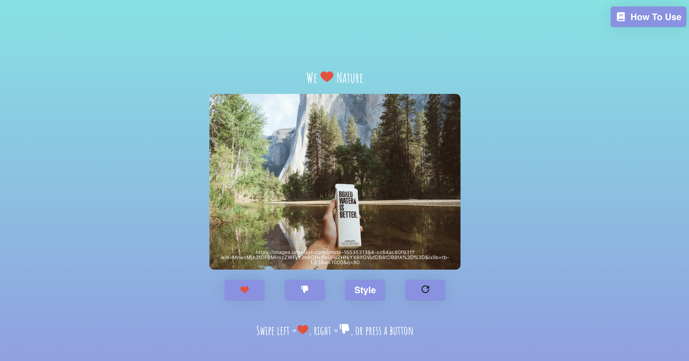

# CS361 Project - "We Love Nature"

"We Love Nature" for CS361(Software Engineering 1) project. 

1. Users can react(Like or Dislike) to nature images by swiping left or right, or pressing a Like/Dislike button. 

2. Users can see new set of nature images with Refresh button by using my microservice(Nature Image Web Scraper(https://github.com/positive235/CS361-image-web-scraper)). 

3. Users can style the image with Style button 

(Currently, a background image comes from other OSU student's image microservice - so, it takes a while to load the background image.)

## Project Showcase Video (about 3 mins)

https://youtu.be/YHwwyDte0tc

## Try it out (maybe it takes a while to load)

https://positive235.github.io/CS361-we-love-nature/

## Screenshots

### HomePage

### Tooltips to breifly explain the features

### Style the image 

### How To Use

### Ask users when pressing a Refresh button

### A new set of nature images after Refresh button

## Credits

(1)
- Copyright file:"https://github.com/3DJakob/react-tinder-card-demo/blob/master/src/examples/Advanced.js" 
- Copyright (c) 2020 All Rights Reserved
- Author: Jakob Unnebäck
- Summary: react-tinder-card Advanced Example

(2)
- Copyright file:"https://github.com/3DJakob/react-tinder-card-demo/blob/master/src/App.css" 
- Copyright (c) 2020 All Rights Reserved
- Author: Jakob Unnebäck
- Summary: react-tinder-card CSS Example 

## Getting Started with Create React App

This project was bootstrapped with [Create React App](https://github.com/facebook/create-react-app).

In the project directory, you can run:

### `npm start`

Runs the app in the development mode.\
Open [http://localhost:3000](http://localhost:3000) to view it in the browser.
